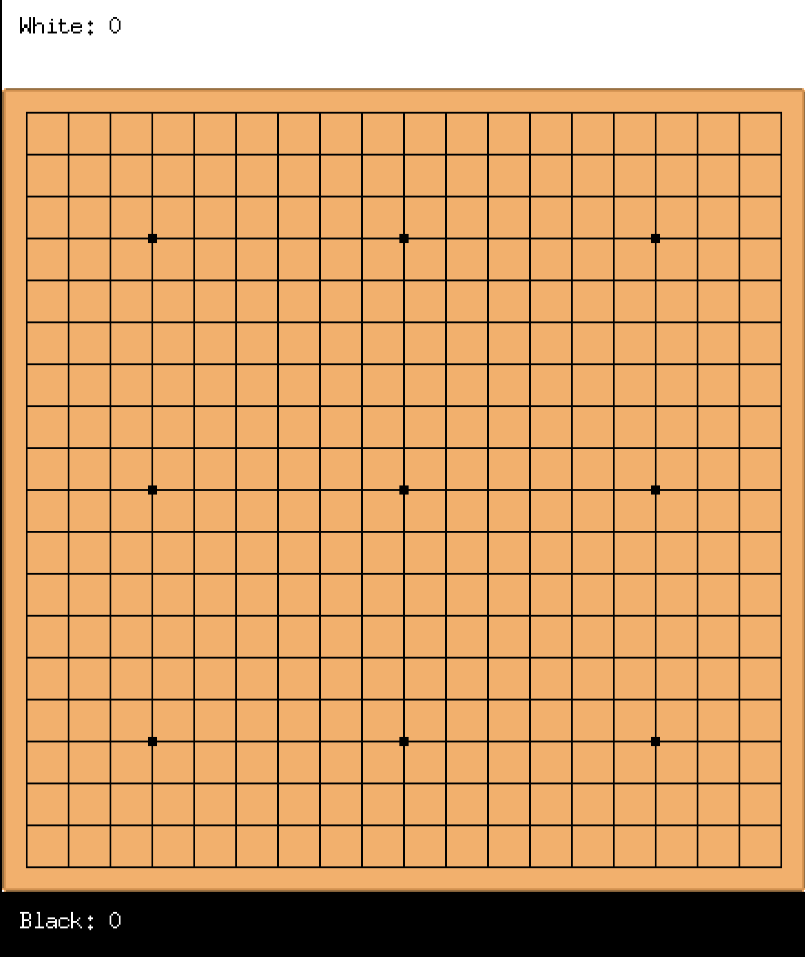

This is an interpretation of Go, also known as Weiqi or Baduk, entirely written in Go.
That's all.





## Prerequisites

Before you start, make sure you have the following installed:

- **Go**: Version 1.18 or higher is required. [Install Go](https://go.dev/doc/install)

## Installation

### 1. Clone the Repository

Clone the repository to your local machine using Git or download the zip:

```bash
git clone https://github.com/Shinzx08/Go-in-Go.git
cd ./Go-in-Go
```

### 2. Install the Dependencies

Run this command to install the dependencies:

```bash
go mod tidy
```

## Running

To start the game:

```bash
go run cmd/game/main.go
```

This will start the game. If you prefer to build and run the game as an .exe, you can do so by following these steps.

### Building the Executable

To compile the game into an executable, run:

```bash
go build -o Go-in-Go ./cmd/game
```